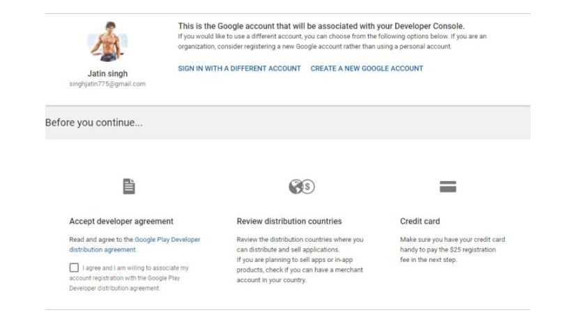

# DeployProject-in-Playstore
## How To Publish Android App On PlayStore:

### Step1:

 First generate signed apk of your Android App to publish it on Play Store.

### Step2:

Now you will need to sign up for Google Play Console to publish and manage your Android App.

**Important Note:**

You can signup with this link [GitHub](https://play.google.com/apps/publish/)

### Step3:

Login with your Gmail account that you want to use for publishing App on Play Store
