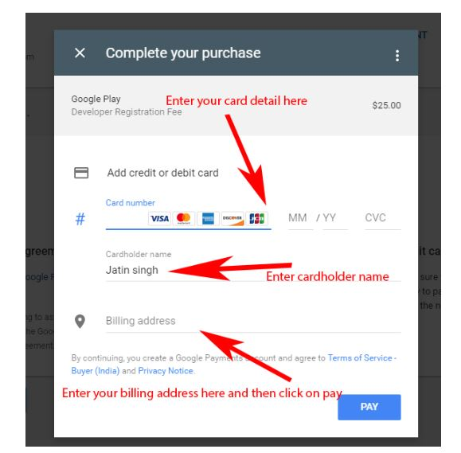
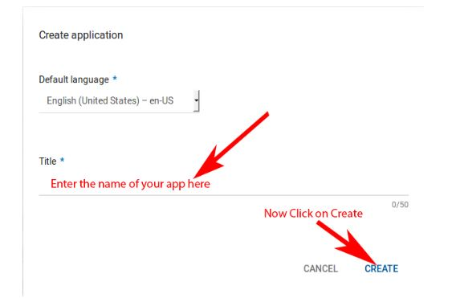

# DeployProject-in-Playstore
## How To Publish Android App On PlayStore:

### Step1:

 First generate signed apk of your Android App to publish it on Play Store.

### Step2:

Now you will need to sign up for Google Play Console to publish and manage your Android App.

**Important Note:**

You can signup with this link [GitHub](https://play.google.com/apps/publish/)

### Step3:

Login with your Gmail account that you want to use for publishing App on Play Store

### Step4:

Now there are 4 steps to complete the registration for Google play store console. You have already completed two.

### Step5:

After reading the Google play store developer distribution agreement agree to their terms by clicking on check box

### Step6:

Now you will need to pay one time ‘Developer Registration Fee’ of $25 to Google. Please fill your credit card details to make the payment.

**ImportantNote:**

You can upload unlimited number of Android App on Play store from single account with a limit of uploading 15 apk/day.

### Step7:

Complete your account details for Google developer account. For example see the below image:

### Step8:

Now click on Create Application

### Step9:

Enter the name of your App

### Step10:

Now fill store listing details of your App which include Title, Short description, and Full description.

### Step11:

 After this you need to put some App screenshots here. The minimum required are 2 screenshots and maximum limit is 8.

### Step12:

After screenshot now you need to put a high Resolution icon or logo with a size of 512 * 512 pixel. This will be displayed on Play Store.

After that another mandatory thing is you need to put a feature graphic of 1024 * 500 pixel dimension. See below image for more detail.

### Step13:

Now scroll down and fill other details which include application type, category, website, email and phone no.

After this check privacy policy because now we are not submitting and then click on save draft. If your App require user permission then it is mandatory to put privacy url.

Click on Save Draft to save your work so far.

### Step14:

After saving data on draft now go to app release and click on manage production.

### Step15:

Now you will see  create release now click on it.

### Step16:

 After click on create release you will see browse files click on it and upload your signed APK.

### Step17:

Once the upload is successful then scroll down and click on review to check.

### Step18:

Now go to Content Rating and click on continue.

### Step19:

Fill details which include email address and select your categories.

### Step20:

Now select Violence, Sexuality, Language, Controlled Substance and Miscellaneous based on your App. First click on save questionnaire for save and then click on calculate rating.

### Step21:

Now click on apply rating.

### Step22:

 Click on pricing and distribution and select free/paid based on how you want user to access your App.

### Step23:

 Now scroll down and see mandatory things with * you need to select After this click on save draft .

### Step24:

 Now Click on ready on publish along with save draft and click on Manage release

### Step25:

 Click on Manage Production

### Step26:

  After Manage production click on edit release.

### Step27:

  Now click on review.

### Step28:

After review click on Start Rollout to production. Now you need to confirm. After confirm you will need to wait for one or six hour for approval.

